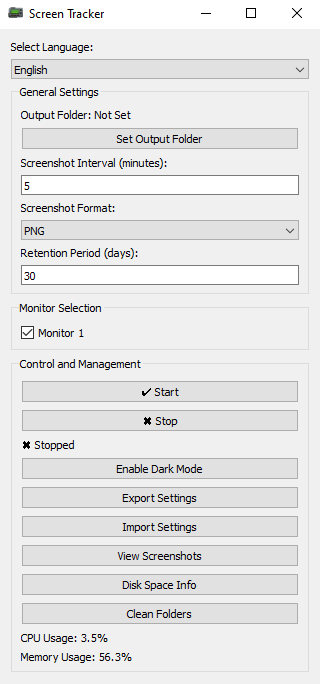

# Screen Tracker

Screen Tracker is an open-source application that captures screenshots at regular intervals, stores them in organized folders, and provides a user-friendly interface for managing and viewing them. This tool is ideal for monitoring screen activity or creating a visual log of your work.

## Features

- **Automated Screenshot Capture**: Takes screenshots at specified intervals.
- **Multi-Monitor Support**: Select which monitors to capture.
- **Dark Mode**: Toggle dark mode for a better viewing experience.
- **Screenshot Viewer**: View and navigate through captured screenshots.
- **Disk Space Info**: Check disk space usage.
- **Folder Cleanup**: Easily clean up old screenshot folders.
- **Multilingual Support**: Available in multiple languages.

## Screenshots



## Installation

### Prerequisites

- Windows operating system
- Python 3.7 or later (for running from source)

### Running the Portable Edition

1. Download the [latest release](releases).
2. Extract the contents of the zip file.
3. Run `ScreenTracker.exe` from the extracted folder.

### Running from Source

1. Clone the repository:
    ```sh
    git clone https://github.com/YuriKaramian/screen-tracker.git
    ```
2. Navigate to the project directory:
    ```sh
    cd screen-tracker
    ```
3. Install the required dependencies:
    ```sh
    pip install -r requirements.txt
    ```
4. Run the application:
    ```sh
    python main.py
    ```

## Usage

1. **Set the Output Folder**: Click on "Set Output Folder" to choose where screenshots will be saved.
2. **Configure Settings**: Adjust the screenshot interval, format, and retention period.
3. **Start Capturing**: Click on "✔ Start" to begin capturing screenshots.
4. **View Screenshots**: Use the "View Screenshots" button to open the screenshot viewer.
5. **Manage Disk Space**: Click on "Disk Space Info" to see disk usage information.
6. **Clean Folders**: Use the "Clean Folders" button to delete old screenshot folders.

## Languages

Screen Tracker is available in the following languages:

- English
- Dutch
- Spanish
- Russian
- Italian
- German
- French
- Armenian
- Georgian
- Bulgarian
- Polish

## Contributing

Contributions are welcome! Please read our [Contributing Guidelines](CONTRIBUTING.md) for more details.

## Support

If you find this project useful, consider supporting its development by [buying me a coffee](https://www.buymeacoffee.com/YuriKaramian).

## License

This project is licensed under the MIT License. See the [LICENSE](LICENSE) file for more details.

## Contact

- **Author**: Yuri Karamian
- **Company**: ArkHost
- **Email**: yuri@arkhost.com
- **Website**: [ArkHost](https://arkhost.com)

## Acknowledgments

Special thanks to all the contributors and the open-source community for their support.

